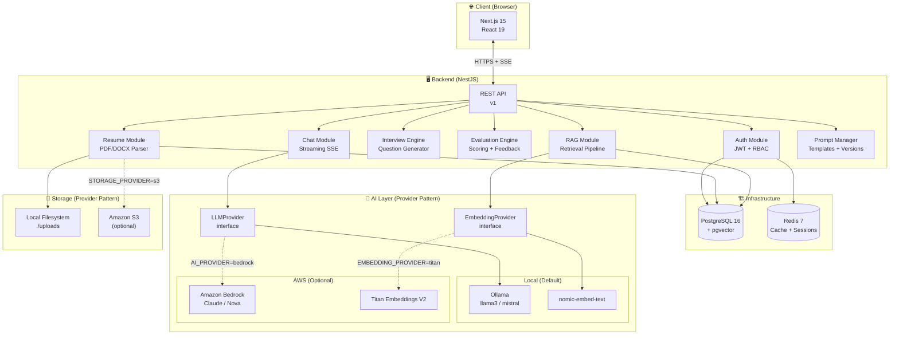
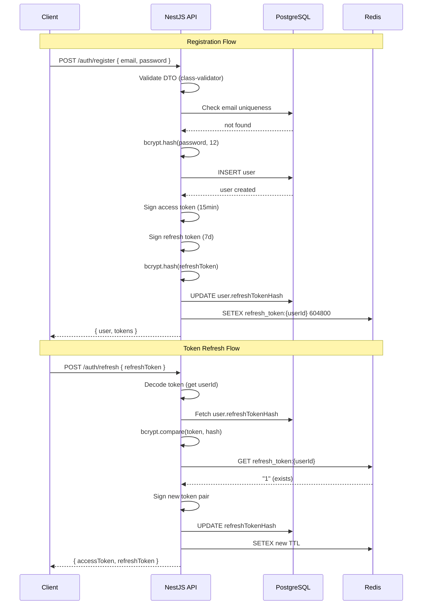
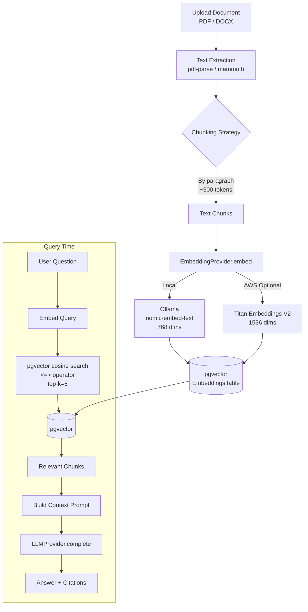
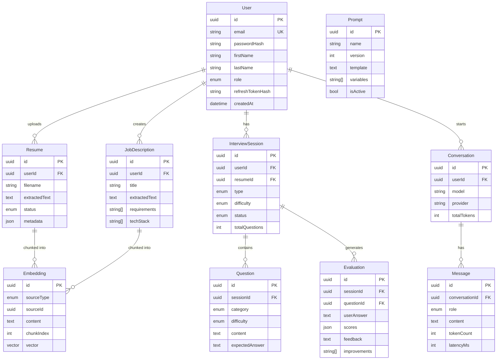

# Architecture Diagrams — AI Interview Assistant

## 1. Overall System Architecture

---

## 2. Authentication Flow

---

## 3. RAG (Retrieval-Augmented Generation) Flow

---

## 4. Database Schema

